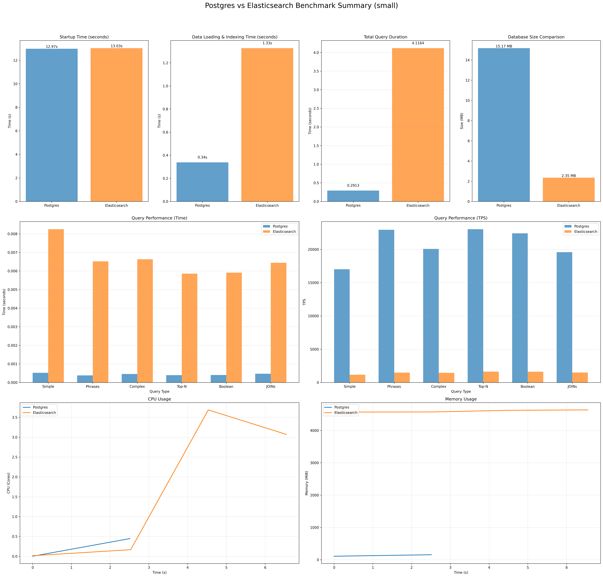
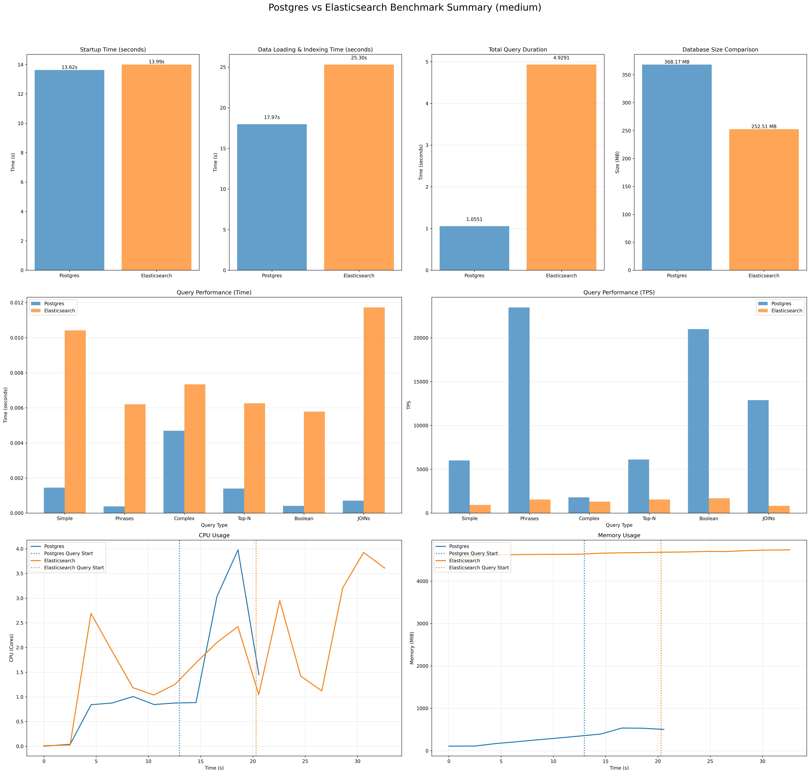
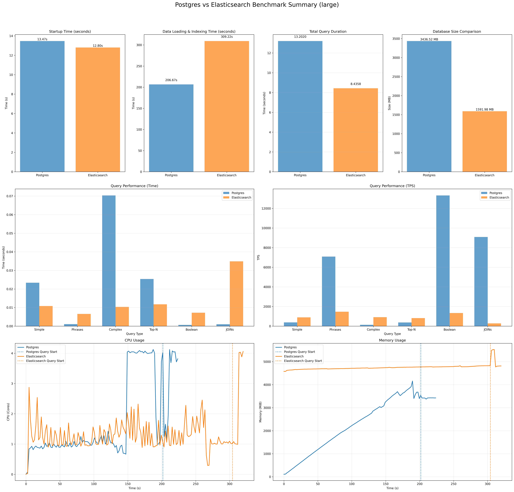

# Postgres (FTS+GIN) vs Elasticsearch: Performance Benchmark Analysis

This project benchmarks the full-text search performance of **PostgreSQL 18** (built-in full-text search with a GIN index on a `tsvector` column) against **Elasticsearch**. The goal is to understand the performance characteristics, trade-offs, and scalability of each solution under controlled conditions.

## 📊 Executive Summary

Based on the latest committed benchmark artifacts in this repo (generated on **2026-01-06**), we observed distinct performance profiles for each system:

*   **Small + Medium scales**: Postgres is faster than Elasticsearch across all 6 query types in this workload.
*   **Large scale (1M parents + 1M children)**: Elasticsearch is faster on the ranked “top-K over many matches” searches (Query 1, 3, 4), while Postgres is faster on Phrase/Boolean and especially the JOIN workload (Query 2, 5, 6).
*   **Why Postgres can underperform**: queries that do `ORDER BY ts_rank_cd(...) DESC LIMIT K` must score and consider *all* matching rows on the Postgres side, which becomes expensive for frequent terms / OR queries at scale.
*   **JOIN Workload (Query 6)**: Postgres uses a relational join against `child_documents`; Elasticsearch uses a `join` field with `has_child` + `inner_hits`.

**Dataset sizing note**: This benchmark generates **one child document per parent document** at each scale (1:1). Concretely: `small` = 1,000 parents + 1,000 children; `medium` = 100,000 + 100,000; `large` = 1,000,000 + 1,000,000.

## 📈 Detailed Results

For a query-by-query explanation of how Elasticsearch vs Postgres behaves (and where semantics differ), see [QUERY_BREAKDOWN.md](QUERY_BREAKDOWN.md).

### Latest Results (as committed) — Concurrency=10, Transactions=1000

These artifacts were generated via:

```bash
./run_tests.sh -s small  -c 10 -t 1000
./run_tests.sh -s medium -c 10 -t 1000
./run_tests.sh -s large  -c 10 -t 1000
```

Summary text files:

* `plots/small_10_1000_performance_summary.txt`
* `plots/medium_10_1000_performance_summary.txt`
* `plots/large_10_1000_performance_summary.txt`

#### Headline workflow metrics

| Scale | Startup (PG vs ES) | Load+Index (PG vs ES) | Total Query Duration (PG vs ES) | Total Workflow (PG vs ES) |
| :--- | :--- | :--- | :--- | :--- |
| small | 12.97s vs 13.03s | 0.34s vs 1.33s | 0.29s vs 4.12s | 13.60s vs 18.47s |
| medium | 13.62s vs 13.99s | 17.97s vs 25.30s | 1.06s vs 4.93s | 32.64s vs 44.22s |
| large | 13.47s vs 12.80s | 206.67s vs 309.22s | 13.20s vs 8.44s | 233.34s vs 330.46s |

Notes:

* The large-scale **query phase** is faster on Elasticsearch overall in this run, because Query 1/3/4 dominate query time.
* The large-scale **total workflow** is still faster on Postgres here, primarily due to faster load+index for this schema + configuration.

#### Visualizations







#### Where Postgres underperforms (large scale)

In the large run, Postgres is slower than Elasticsearch on:

* **Query 1 (Simple)**: 0.0234s vs 0.0108s
* **Query 3 (Complex OR)**: 0.0704s vs 0.0104s
* **Query 4 (Top-N)**: 0.0254s vs 0.0117s

These are the queries that do ranked top-K retrieval. On Postgres the benchmark uses:

```sql
ORDER BY ts_rank_cd(documents.content_tsv, q.query) DESC
LIMIT K;
```

That forces ranking work over the entire candidate set, which grows quickly for frequent terms and disjunctions at scale. See the saved plans:

* `results/explain_analyze_query_1.txt`
* `results/explain_analyze_query_3.txt`
* `results/explain_analyze_query_4.txt`


## 🔬 Methodology

The benchmarks were conducted using a containerized environment to ensure isolation and reproducibility.

*   **Hardware**: MacBook Pro M1.
*   **Environment**: Local Kubernetes cluster running in Docker (configured with 8 CPUs and 12GB RAM).
*   **Software Versions**:
    *   Docker: 29.1.3
    *   Kubernetes Client: v1.34.1
    *   Python: 3.10.15
    *   Elasticsearch: 8.11.0
    *   PostgreSQL: 18
*   **Resources**: Both systems were restricted to identical CPU and Memory limits (4 CPU, 8GB RAM, configurable in `config/benchmark_config.json`) to ensure a fair fight.
*   **Data Storage Differences**: 
    *   **PostgreSQL**: Stores full raw text data in tables (title/content) plus a `tsvector` GIN index, resulting in a larger storage footprint than a pure search engine index.
    *   **Elasticsearch**: Only maintains compressed inverted indexes and tokenized data optimized for search, resulting in more efficient storage.
    *   **Why Postgres often looks larger in this benchmark**: the measured size includes table heap storage (raw `title`/`content`), MVCC/page overhead, and secondary indexes (GIN on `documents.content_tsv`, plus btree/GIN indexes on `child_documents`). Elasticsearch’s reported store size is optimized for search workloads and does not map 1:1 to Postgres heap+index accounting.
*   **Workload**:
    *   **Ingestion**: Bulk loading of JSON documents.
    *   **Queries**: The benchmark executes a mix of 6 distinct query types to simulate real-world usage patterns:
        1.  **Query 1 (Simple Search)**: Single-term full-text search (e.g., "strategy", "innovation"). Tests basic inverted index lookup speed.
        2.  **Query 2 (Phrase Search)**: Exact phrase matching (e.g., "project management"). Tests position-aware index performance.
        3.  **Query 3 (Complex Query)**: Two-term *OR* query (Postgres uses a tsquery `term1 OR term2`; Elasticsearch uses a `bool.should`). Tests disjunction performance.
        4.  **Query 4 (Top-N Query)**: Single-term search with a higher result limit (**N=50 results** by default). Tests ranking and retrieval optimization for paginated views.
        5.  **Query 5 (Boolean Query)**: A three-clause boolean query over `content` with positive and negative terms. (Implementation note: this benchmark treats the “must” and “should” terms as required on the Postgres side; Elasticsearch uses `must`/`should`/`must_not`.)
        6.  **Query 6 (JOIN Query)**: Join parents to children.
            *   **PostgreSQL**: `documents` JOIN `child_documents` on `child_documents.parent_id = documents.id`, filtered by a full-text predicate on the parent.
            *   **Elasticsearch**: Parent/child join using a `join_field` mapping and `has_child` query (includes `inner_hits`).
    *   **Concurrency**: The benchmark supports configurable concurrency. The committed results in this repo were run with **10 concurrent clients**.

### Data Model / Schema (UML ASCII)

The benchmark uses a parent/child model so Query 6 can exercise a JOIN-style workload.

```
                 +---------------------------+
                 |         documents         |
                 +---------------------------+
                 | id: UUID (PK)             |
                 | title: TEXT               |
                 | content: TEXT             |
                 +---------------------------+
                              1
                              |
                              | (logical relationship via data->>'parent_id'
                              |  in child JSON; not a SQL FK)
                              |
                              *
                 +---------------------------+
                 |      child_documents      |
                 +---------------------------+
                 | id: UUID (PK)             |
                 | data: JSONB               |
                 |  - parent_id: UUID        |
                 |  - data: {...}            |
                 +---------------------------+


Elasticsearch index: documents
  - join_field: join { parent -> child }
  - parent docs: join_field = "parent"
  - child docs:  join_field = { name: "child", parent: <parent_id> }, routed by parent_id
```

### Metric Definitions and Calculations

The benchmark measures several key performance metrics:

*   **Iterations (Transactions)**: The total number of queries executed for each query type. This represents the workload volume.
*   **Concurrency**: The number of simultaneous client threads executing queries in parallel. Higher concurrency simulates more users.
*   **Average Query Latency**: The average time taken per individual query, calculated as the total execution time across all workers divided by the total number of transactions. This metric represents the response time experienced by clients.
*   **TPS (Transactions Per Second)**: The throughput metric, calculated as total transactions divided by the wall time. This shows how many queries the system can process per second under the given concurrency.
*   **Wall Time**: The total elapsed time from the start to the end of the benchmark run for a specific query type and concurrency level.

**Relationships and Computations**:
- TPS = Total Transactions / Wall Time
- Average Latency = (Sum of individual worker execution times) / Total Transactions
- Wall Time is measured across concurrent execution, so it represents the time until the last worker completes
- Higher concurrency typically reduces wall time but may increase average latency due to resource contention
- Iterations determine the statistical significance; more iterations provide more reliable average latency measurements

*   **Data Generation**:
    *   Synthetic data is generated using real English words (sourced from `dwyl/english-words`) to ensure realistic term frequency and distribution, rather than random character strings.
    *   Documents simulate business reports with fields like `title`, `description`, `category`, etc.

*   **Client Implementation**:
    *   **PostgreSQL**: Uses `psycopg2` with `ThreadedConnectionPool` to efficiently manage database connections across concurrent threads.
    *   **Elasticsearch**: Uses Python `requests` with `HTTPAdapter` to enable connection pooling and automatic retries, ensuring optimal HTTP performance.
    *   **Concurrency Model**: Both benchmarks utilize Python's `ThreadPoolExecutor` to spawn concurrent worker threads, simulating real-world parallel user requests.

*   **Resource Monitoring**:
    *   Real-time resource usage (CPU & Memory) is captured using `docker stats` (since `kubectl top` was not available in the local environment) to ensure accurate measurement of container overhead.

## 📂 Project Structure

```
├── config/                 # Benchmark configuration
├── data/                   # Generated synthetic data
├── k8s/                    # Kubernetes deployment manifests
├── plots/                  # Generated performance plots and summaries
├── results/                # Raw benchmark results (JSON, CSV)
├── scripts/                # Python scripts for benchmarking and monitoring
├── generate_plots.py       # Plot generation script
├── run_tests.sh            # Main benchmark runner script
└── requirements.txt        # Python dependencies
```

## 🛠️ How to Reproduce

To run these benchmarks yourself and verify the results:

1.  **Prerequisites**: Docker and Python 3.
2.  **Install Dependencies**: `pip install -r requirements.txt`
3.  **Run Benchmark**:
    ```bash
    # Run Large scale benchmark using defaults from config/benchmark_config.json
    ./run_tests.sh -s large

    # Reproduce the committed runs (1k transactions/query, 10 clients)
    ./run_tests.sh -s small  -c 10 -t 1000
    ./run_tests.sh -s medium -c 10 -t 1000
    ./run_tests.sh -s large  -c 10 -t 1000
    ```
4.  **View Results**:
    *   Summaries and plots are generated in the `plots/` directory.
    *   Raw timing logs and resource usage data are in the `results/` directory.
    *   **Query Plans**: For Postgres, `EXPLAIN ANALYZE` output for each query type is saved to `results/explain_analyze_query_X.txt` (X = 1..6) to assist with performance debugging.
    *   Configuration can be tweaked in `config/benchmark_config.json`.

### Advanced Usage

The `run_tests.sh` script supports several flags to customize the benchmark run:

| Flag | Description | Default |
| :--- | :--- | :--- |
| `-s, --scale` | Data scale (`small`, `medium`, `large`) | `small` |
| `-c, --concurrency` | Number of concurrent clients | From config |
| `-t, --transactions` | Number of transactions per query type | From config |
| `--cpu` | CPU limit for databases (e.g., `4`, `1000m`) | From config |
| `--mem` | Memory limit for databases (e.g., `8Gi`, `4GB`) | From config |
| `-d, --databases` | Specific databases to run (`postgres`, `elasticsearch`) | Both |

**Examples:**

```bash
# Run with custom concurrency and transaction count
./run_tests.sh -s medium -c 10 -t 500

# Benchmark only Postgres with specific resource limits
./run_tests.sh -d postgres --cpu 2 --mem 4Gi
```

## ⚙️ Configuration

The benchmark is highly configurable via `config/benchmark_config.json`. Key sections include:

*   **`benchmark`**: Global defaults for concurrency and transaction counts.
*   **`data`**: Defines the number of documents for `small`, `medium`, and `large` scales.
*   **`resources`**: (Used by the runner) Defines default CPU/Memory requests and limits for the Kubernetes deployments.
*   **`queries`**: Defines the specific terms used for each query type. You can modify the lists of terms (e.g., `simple.terms`, `complex.term1s`) to change the search corpus.

## 📦 Data & Output Artifacts

### Data files

The runner generates and/or consumes two datasets per scale:

*   Parent documents: `data/documents_{scale}.json`
*   Child documents: `data/documents_child_{scale}.json`

Child documents contain a `parent_id` that references a parent document `id`. Both Postgres and Elasticsearch load child documents when the file exists.

**Child document counts (by scale)**: The generator produces the same number of child docs as parent docs (1:1), based on the `data.*_scale` values in `config/benchmark_config.json`.

### Results files

The benchmark runner and plot generator use a scale+concurrency+transactions naming convention:

*   `results/{scale}_{concurrency}_{transactions}_{db}_results.json`
*   `results/{scale}_{concurrency}_{transactions}_{db}_resources.csv`
*   `results/{scale}_{concurrency}_{transactions}_{db}_startup_time.txt`
*   Postgres query plans: `results/explain_analyze_query_{1..6}.txt`

The committed example artifacts include:

*   `results/small_10_1000_*`, `results/medium_10_1000_*`, `results/large_10_1000_*`
*   `plots/small_10_1000_*`, `plots/medium_10_1000_*`, `plots/large_10_1000_*`

## ⚠️ Limitations & Future Work

*   **Read-Heavy Focus**: This benchmark primarily focuses on search performance (read latency and throughput). While ingestion time is measured, high-throughput ingestion scenarios (updates, deletes) are not currently covered.
*   **Single Node**: The current setup deploys single-node instances of both Postgres and Elasticsearch. Distributed cluster performance and high-availability scenarios are not tested.
*   **Cold vs. Warm Cache**: The benchmark runs queries in sequence. While multiple iterations are performed, explicit controls for cold vs. warm cache testing are not strictly enforced, though the "warm-up" effect is naturally captured in the average latency over many transactions.

